# Test Diciembre 2024

Este proyecto permite gestionar clientes mediante una API construida con ASP.NET Core
y un frontend en HTML, CSS y JavaScript.

## Requisitos

- **.NET SDK**: [Descargar aquí](https://dotnet.microsoft.com/download)
- **Visual Studio Code** o cualquier editor de texto.
- **Navegador web** para probar la interfaz.
- **Newtonsoft.Json:** Biblioteca para trabajar con JSON.
- **Postman** para probar las rutas de la API.

## Instrucciones de instalación y ejecución

### Backend (API en ASP.NET Core)

1. Clona el repositorio:

   git clone https://github.com/Agustina-Flores/TestDiciembre2024.git

2. Directorio

- cd TestDiciembre2024-master\TestDiciembre2024-master

### Instalar dependencias del backend:

-Restaurar dependencias de .NET:

dotnet restore

-Newtonsoft.Json si no está presente en el proyecto:

dotnet add package Newtonsoft.Json:

-Ejecutar la API

dotnet run

La API estará disponible en la siguiente URL :

Clientes: http://localhost:5029/api/customer
Nota: Si el puerto 5029 está ocupado, el proyecto podría utilizarse en un puerto diferente.

### Frontend (HTML, CSS y JavaScript)

El frontend se encuentra en index.html, que se puede acceder en el navegador en:

http://localhost:5029/index.html

(index.html esta en la carpeta wwwroot.)

## Endpoints de la API

### 1. [**GET /customer/**]

**Descripción**: Obtiene la lista de todos los clientes: http://localhost:5029/api/customer

**Cuerpo de la solicitud (Request Body)**:  
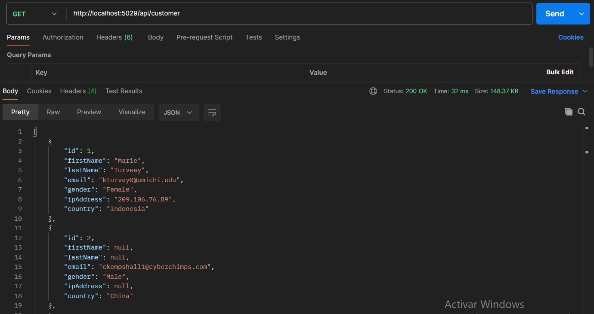

### 2. [**POST /customer/**]

**Descripción**: Crea un nuevo cliente: http://localhost:5029/api/customer

**Cuerpo de la solicitud (Request Body)**:  
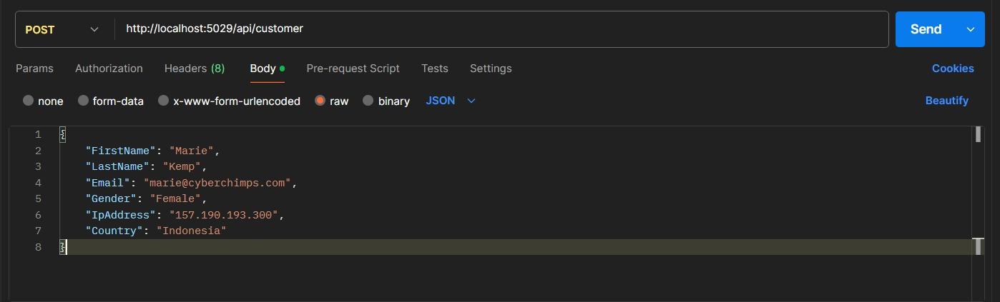

### 3. [**PUT /customer/**]

**Descripción**: Edita un cliente: http://localhost:5029/api/customer/2

**Cuerpo de la solicitud (Request Body)**:  
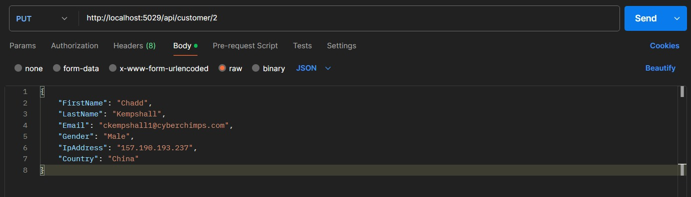

### 4. [**DELETE /customer/**]

**Descripción**: Elimina un cliente : http://localhost:5029/api/customer/1002

**Cuerpo de la solicitud (Request Body)**:  
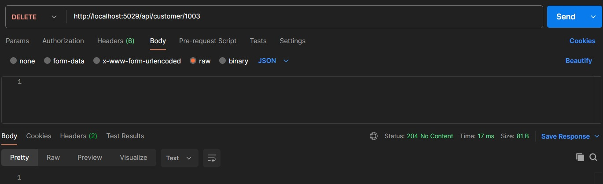

### Capturas de pantalla del proyecto

**Formulario para agregar/editar cliente:**

- Agregar Nuevo Cliente
  

- Editar Cliente
  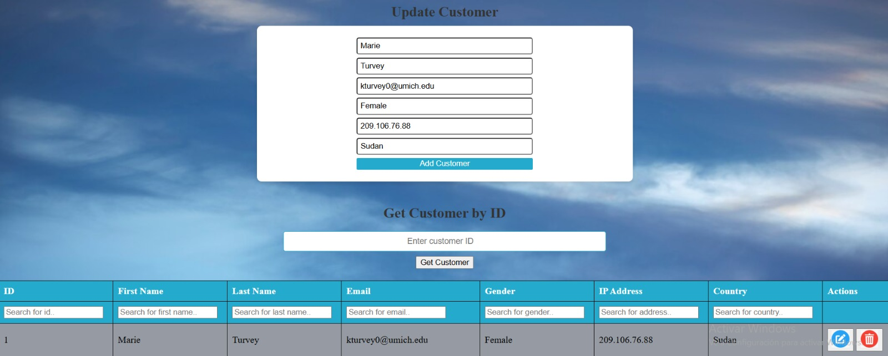

- Datos modificados
  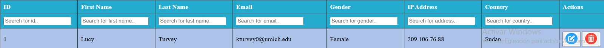

- Eliminar Cliente
  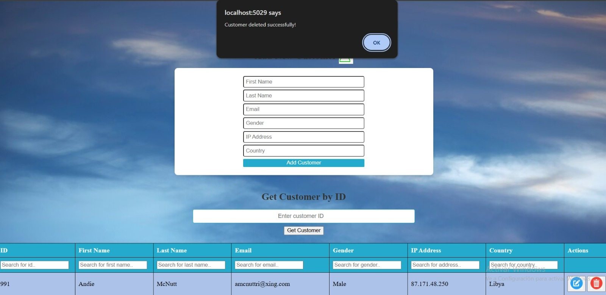

**Obtener Datos de un Cliente por ID:**
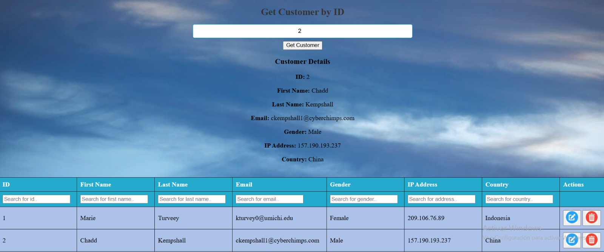

**Listado de Clientes con Paginación**
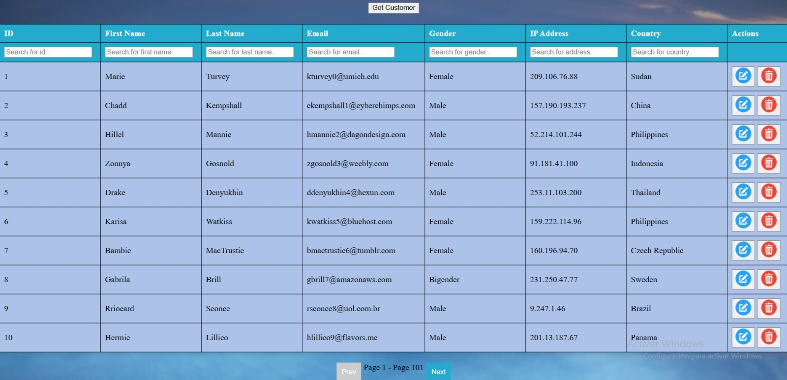

**Filtros**
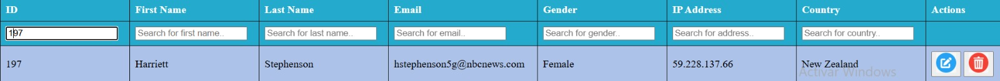

**Cambio de orden en el encabezado**
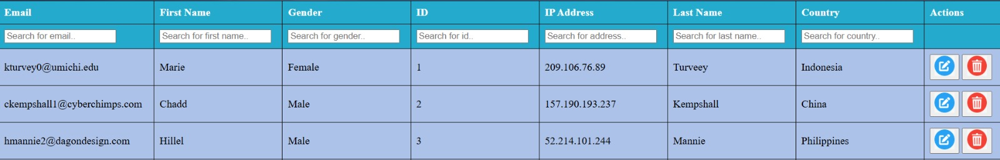
